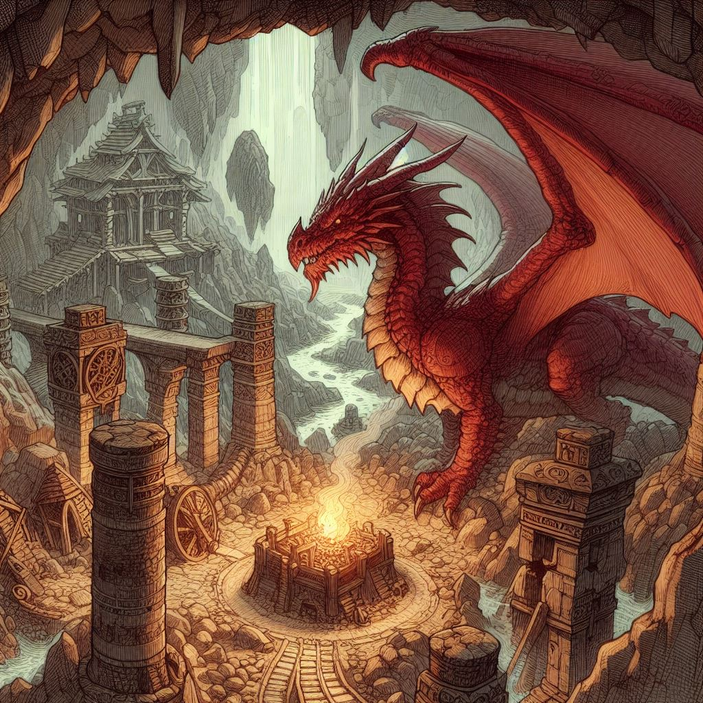

# Desafio Lab Dia Natty or Not

## 1 - Das seguintes frases a baixo, qual foi escrita por um autor brasileiro e qual foi gerada por IA ?

### 1.1 Qual das duas frases foi dita por chico buarque ?

  

    
 A felicidade 
        Morava tão vizinha 
        Que, de tolo 
        Até pensei que fosse minha.
    

     
    <input type="checkbox" id="checkbox1">
    <label for="checkbox1">Opção 1</label>
  

  

    
Na esquina da vida, o samba dança com a saudade

     
    <input type="checkbox" id="Opção2">
    <label for="checkbox2">Opção 2</label>
  

### 1.1 Qual das duas frases foi dita por chico buarque ?

  

    
No tear da vida, teço sonhos com fios de esperança, 
    entrelaçando alegrias e tristezas,  
    num mosaico de cores que reflete a beleza da alma.
    

     
    <input type="checkbox" id="checkbox1">
    <label for="checkbox1">Opção 1</label>
  

  

    
O que vale na vida não é o ponto de partida e sim a caminhada. 
    Caminhando e semeando, no fim, terás o que colher.

     
    <input type="checkbox" id="Opção2">
    <label for="checkbox2">Opção 2</label>
  

## 2 - Das seguintes imagens, qual foi gerada por IA e qual foi feita por um artista ?

### 2.1 Qual dragão foi desenhado por IA ?

  

    
     
    <input type="checkbox" id="checkbox1">
    <label for="checkbox1">Opção 1</label>
  

  

    
     
    <input type="checkbox" id="Opção2">
    <label for="checkbox2">Opção 2</label>
  

### Das seguintes fotos, qual é real e qual foi gerada por IA ?

### 3.1 Desatre Rio Grande do Sul 

  

    
     
    <input type="checkbox" id="checkbox1">
    <label for="checkbox1">Opção 1</label>
  

  

    
     
    <input type="checkbox" id="Opção2">
    <label for="checkbox2">Opção 2</label>
  

### 3.1 Rosto Humano

  

    
     
    <input type="checkbox" id="checkbox1">
    <label for="checkbox1">Opção 1</label>
  

  

    
     
    <input type="checkbox" id="Opção2">
    <label for="checkbox2">Opção 2</label>
  

## Das seguintes vozes, qual é a voz original ?

### 4.1

